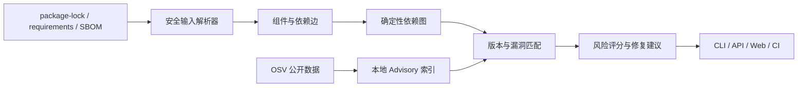

# SupplyGuard

SupplyGuard 是一个离线优先、可解释的软件供应链安全分析平台。它面向开源项目解析依赖清单与 SBOM，构建确定性依赖图，并计划结合 OSV 公开漏洞数据生成漏洞证据、依赖路径、修复建议和 CI 门禁结果。

> 当前版本为 `0.1.0.dev0`，已经完成依赖解析与统一图模型，但尚未完成漏洞数据匹配，因此不能被当作生产可用的漏洞扫描器。

## 项目目标

- 使用公开、免费数据完成供应链风险分析，默认额外成本为 0 元。
- 核心扫描支持离线运行，不依赖大模型、付费 API、云 GPU 或云服务器。
- 所有结论保留数据来源、组件坐标、文件位置和依赖路径。
- 对无法验证的数据显式失败或告警，不静默忽略。
- 将核心领域模型与 CLI、API、数据库和前端解耦。

## 当前进度

| 里程碑 | 状态 | 已实现内容 |
|---|---|---|
| M0 治理和工程骨架 | 已完成 | 独立虚拟环境、CLI、测试门禁、项目规则和跨线程报告 |
| M1 依赖解析与统一图模型 | 已完成 | package-lock、requirements、PURL、依赖图、路径查询和环检测 |
| M2 OSV 数据与漏洞匹配 | 进行中 | Advisory 模型、SemVer 事件范围和可解释组件匹配已实现；本地索引待完成 |
| M3 风险报告和 SBOM | 未开始 | JSON、终端报告与 CycloneDX |
| M4 API 与 Web 控制台 | 未开始 | FastAPI、任务管理与可视化 |
| M5 修复建议、策略与 CI | 未开始 | 升级建议、豁免策略和门禁 |
| M6 基准、发布与简历材料 | 未开始 | 公开评测、演示和真实指标 |

详细状态和每次推进证据见 [`REPORT.md`](REPORT.md)，完整范围与验收条件见 [`PROJECT_PLAN.md`](PROJECT_PLAN.md)。

## 已实现能力

### 输入解析

- npm `package-lock.json` v2/v3。
- 嵌套 `node_modules` 解析、scoped 包和 workspace link。
- runtime、development、optional 和 peer 依赖范围。
- Python `requirements.txt` 精确 `name==version` 固定输入。
- 注释、extras、hash continuation、重复固定版本和环境标记。
- 文件大小限制、UTF-8 校验和结构化解析告警。

### 统一模型

- npm 与 PyPI 名称规范化。
- 以 Package URL（PURL）作为稳定组件 ID。
- 项目相对文件证据和 JSON Pointer/行号定位。
- 不可变组件、依赖边和依赖范围模型。
- 组件去重时合并全部来源证据。

### 图能力

- 确定性组件及依赖边排序。
- 悬空引用校验。
- 直接依赖查询。
- 有数量及深度限制的根到组件路径查询。
- 基于 Tarjan 算法的循环强连通分量检测。

### OSV 与匹配（M2 进行中）

- OSV Advisory、AffectedPackage、VersionRange 和事件模型。
- `introduced`、`fixed`、`last_affected` 与 `limit` 端点语义。
- 无第三方依赖的 SemVer 2.0 比较，包括 prerelease 顺序。
- npm SEMVER 范围匹配和修复版本证据。
- npm/PyPI `affected.versions` 显式版本匹配。
- 对暂不支持的 ECOSYSTEM/GIT 范围返回结构化跳过原因。

## 架构



当前代码已经覆盖依赖输入、图模型、OSV 模型和首批匹配；本地索引、增量同步与完整离线查询仍属于 M2 后续工作。

## 快速开始

### 环境要求

- Windows PowerShell
- Python 3.12 或更高版本
- M0-M1 当前实现不需要下载第三方 Python 依赖

### 创建独立环境

```powershell
git clone https://github.com/Knightzheng/SupplyGuard.git
cd SupplyGuard
.\scripts\bootstrap.ps1
```

脚本只创建项目目录内的 `.venv`，Python 字节码和临时文件写入项目内 `.tmp`，不会修改全局 Python 环境。

### 使用 CLI

```powershell
.\.venv\Scripts\python -m supplyguard --version
.\.venv\Scripts\python -m supplyguard --help
```

扫描命令将在 OSV 匹配与报告链路完成后开放；当前 CLI 只提供版本和帮助入口。

## 运行测试

```powershell
.\scripts\check.ps1
```

当前检查包括 Python 语法编译和 41 项 `unittest`。测试覆盖：

- CLI 版本、帮助和错误参数。
- npm/PyPI 名称规范化与稳定 PURL。
- 来源路径安全与目录穿越拒绝。
- 依赖图合并、路径和环检测。
- package-lock v2/v3、嵌套依赖和 workspace link。
- requirements 精确固定、未固定版本告警和损坏输入。
- UTF-8、体积上限和项目内临时文件读取。
- OSV Schema 关键字段、事件序列、SemVer 边界及匹配证据。

这里的“41 项通过”是当前仓库可复现的测试数量，不代表已经完成漏洞检测效果评测。

## 安全边界

- 将待扫描仓库视为不可信输入。
- 只解析依赖文件，不执行 npm/pip 安装脚本或项目代码。
- 不将本地绝对路径、令牌或密钥写入公开报告。
- 未固定版本、URL、include 指令和未知输入不会被伪装成精确组件。
- requirements 是扁平清单，不能恢复真实传递依赖来源；后续报告会明确这一限制。
- 当前尚未完成 OSV 本地数据同步和完整生态版本比较，不能据此判断仓库是否不存在已知漏洞。

## 项目治理

- [`PROJECT_RULES.md`](PROJECT_RULES.md)：文件边界、成本、测试和交接硬规则。
- [`PROJECT_PLAN.md`](PROJECT_PLAN.md)：目标、范围、架构、里程碑和完成定义。
- [`REPORT.md`](REPORT.md)：当前事实、风险、架构决策和追加式推进记录。

项目开发只允许修改当前项目目录。外部目录只能读取，或将许可明确的文件复制进项目目录。

## 许可证

本项目采用 [Apache License 2.0](LICENSE)。
